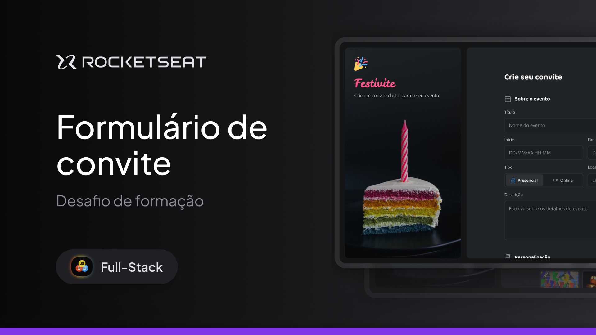

## Formulário de Convite

  

## 🖥️ Sobre o Projeto

Neste repositório está hospedado um layout responsivo de um formulário para confecção de um convite de evento, este projeto foi desenvlvido com intuito de consolidar os fundamentos de html forms e estilização com css, tudo isso sob acompanhamento da trilha de Fullstack do curso de desenvolvimento web da Rocketseat.

## 🚧 Status

Atualmente todo o Layout do projeto está finalizado e fica a mercê de integração com backend e conexão com bancos de dados.

## 🍪 Acesso ao Projeto

Este projeto pode ser visualizado através deste [link](https://ppedrolucas.github.io/InviteForm/).

## 🚀 Tecnologias

As seguintes ferramentas foram usadas para o desenvolvimento do projeto:

  

Feito com ❤️ por Pedro Lucas 👋🏽
